<div align="center">

# GRANNY'S HOUSE — SCARY ESCAPE

**A Granny-style first-person survival horror game that runs entirely in your browser.**

Built with **Next.js 16 · React 19 · Three.js (r184) · TypeScript** — no game engine, no Unity, no downloads.

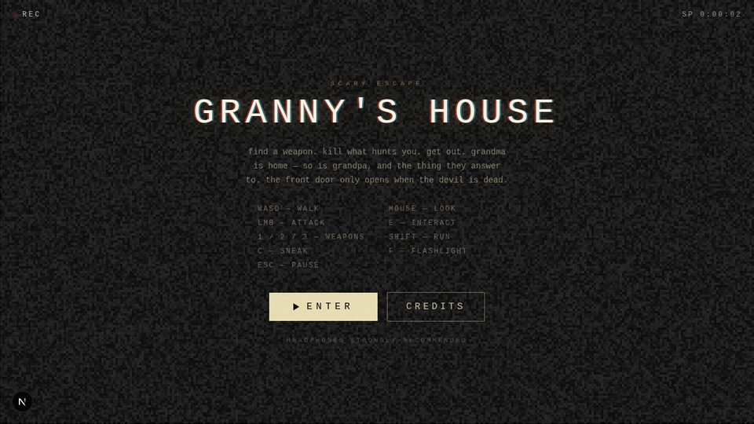

[](https://github.com/Jennofrie/Horror-Granny)
[](https://threejs.org)
[](https://nextjs.org)
[](https://react.dev)
[](public/assets/ATTRIBUTION.md)
[](LICENSE)
[](https://github.com/Jennofrie/Horror-Granny)
[](https://x.com/Profexor)

</div>

---

## Table of contents

- [The game](#the-game)
- [Screenshots](#screenshots)
- [How a run works](#how-a-run-works)
- [Controls](#controls)
- [The hunters](#the-hunters)
- [Weapons & ammo](#weapons--ammo)
- [Hiding](#hiding)
- [Balance (final numbers)](#balance-final-numbers)
- [Tech stack](#tech-stack)
- [Architecture](#architecture)
- [Asset pipeline](#asset-pipeline)
- [Development](#development)
- [Testing](#testing)
- [Portal build (CrazyGames etc.)](#portal-build-crazygames-etc)
- [Project structure](#project-structure)
- [Credits](#credits)
- [License](#license)

---

## The game

You wake up in a decrepit rural house at night. **Grandma is home.** So is
grandpa — and the thing they both answer to. The front door is held shut by
whatever owns this place, and it only lets go when the devil is dead.

> **Find a weapon. Kill what hunts you. Get out.**

- **Arm yourself.** A fire axe in the garage, a handgun in the study, a
  shovel in storage — plus 2–3 crates of 9mm rounds hidden in the house
  (seeded per run, so every playthrough is a little different).
- **The kill chain.** One hunter at a time: **Grandma** wakes ~20 seconds
  in. Put her down and a few breaths of quiet follow — then **Grandpa**
  walks in. Then **the Devil**. Each one is faster, tougher, and harder to
  shake than the last.
- **The door.** Killing the devil breaks the house's hold on the front
  door. Push it open and walk into the light — that's the only way out.
- **Hide.** Wardrobes and under-bed spots make you invisible and silent —
  unless it *saw* you climb in, in which case it walks over, looks inside,
  and drags you out. Searching enemies sometimes check furniture on
  paranoid hunches.
- **Manage noise and light.** Sprinting and gunfire are loud — the hunter
  hears both. Sneaking is silent but slow. It smothers the lights around
  itself, and your flashlight flickers when it's close.

Headphones strongly recommended.

---

## Screenshots

### The house — 12 hand-designed rooms on one creaking floor

| | |
|---|---|
| 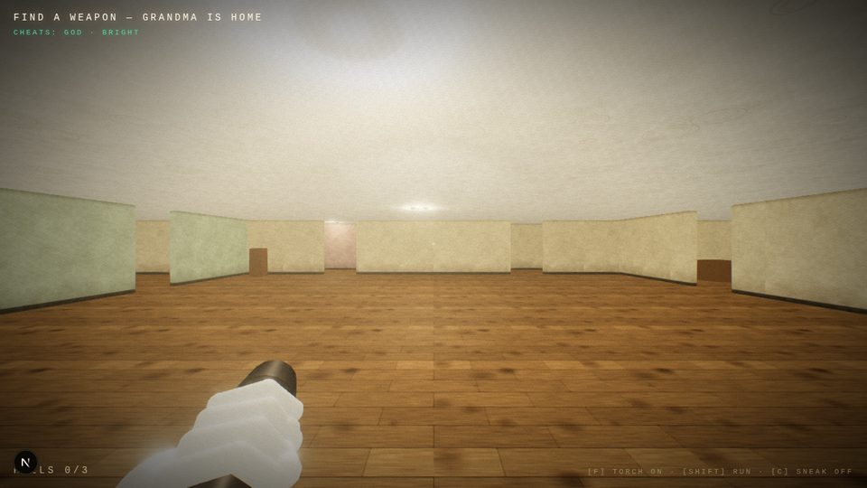 | 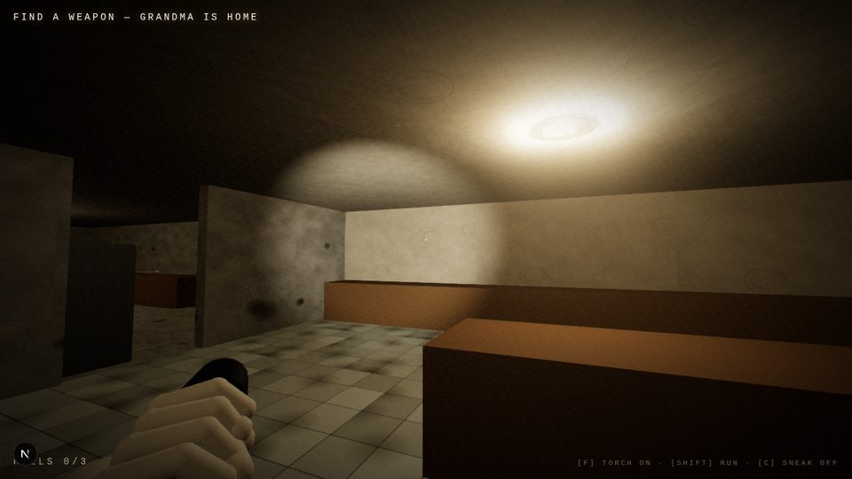 |
| 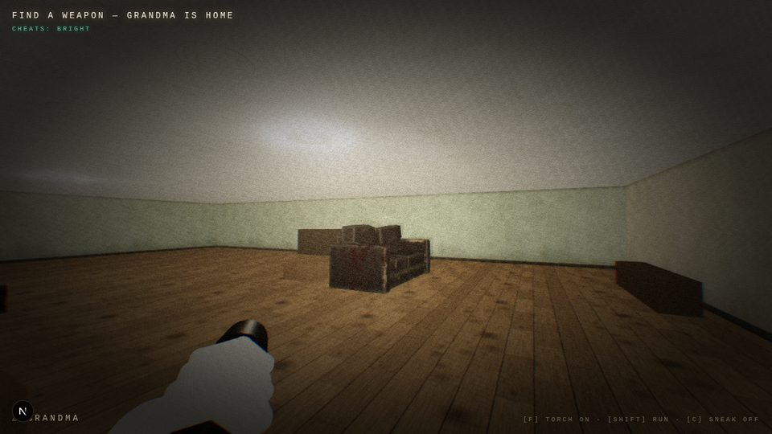 | 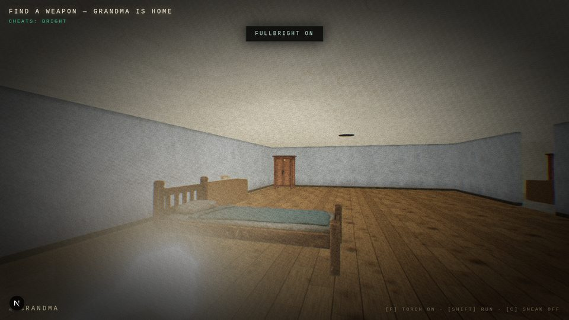 |

### The hunters

| Grandma in the muzzle flash | The Devil arrives |
|---|---|
| 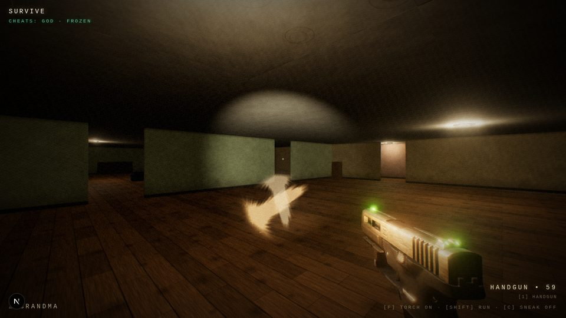 | 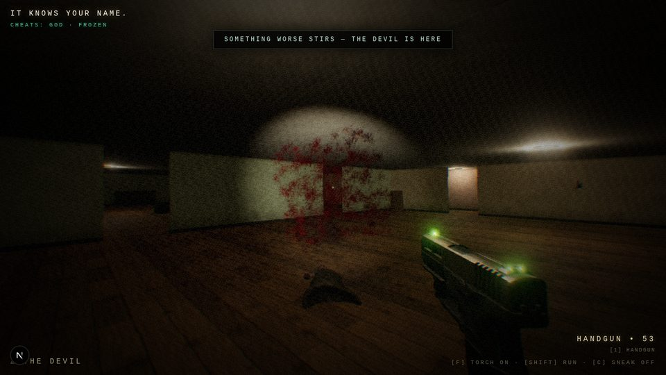 |

### Weapons — find them scattered around the house

| Handgun | Fire axe |
|---|---|
| 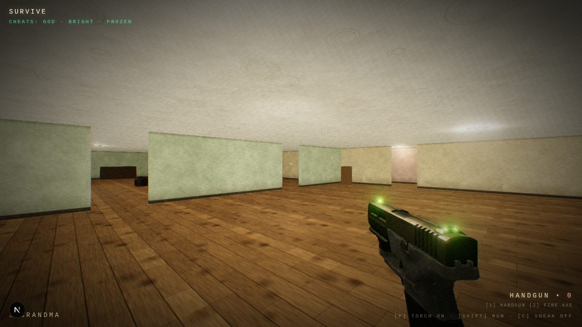 | 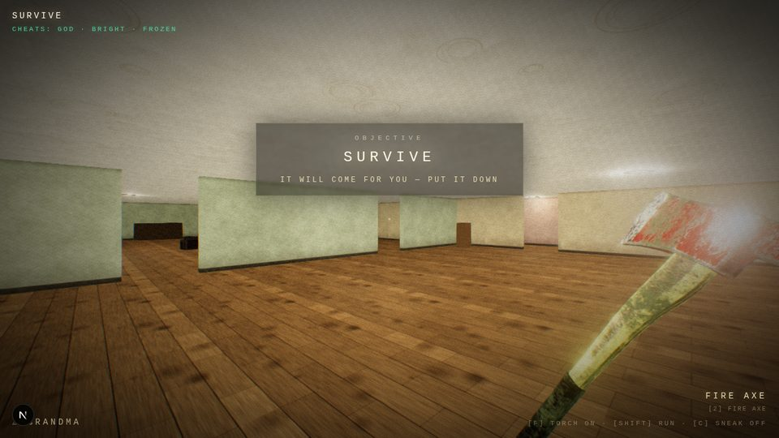 |

### Combat — every shot is loud, every miss hurts

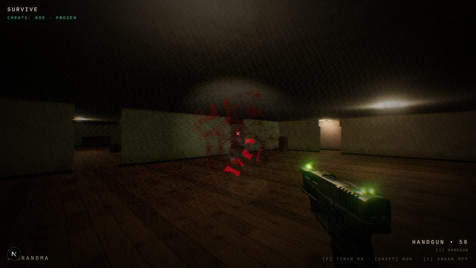

### Hiding — wardrobes and under-beds save you… unless it saw you climb in

| | |
|---|---|
| 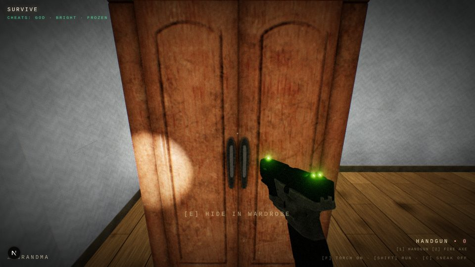 | 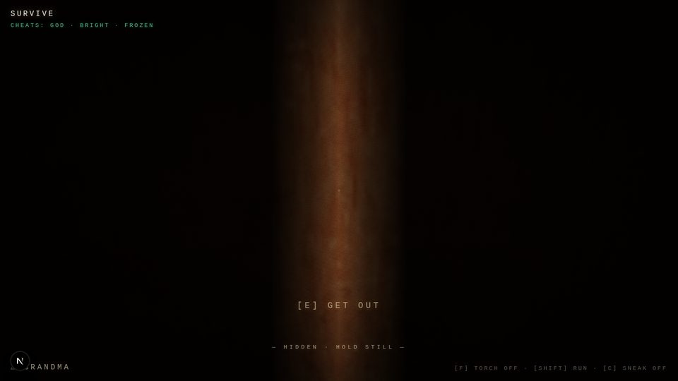 |

### The only way out

| The front door, unlocked | You got out |
|---|---|
| 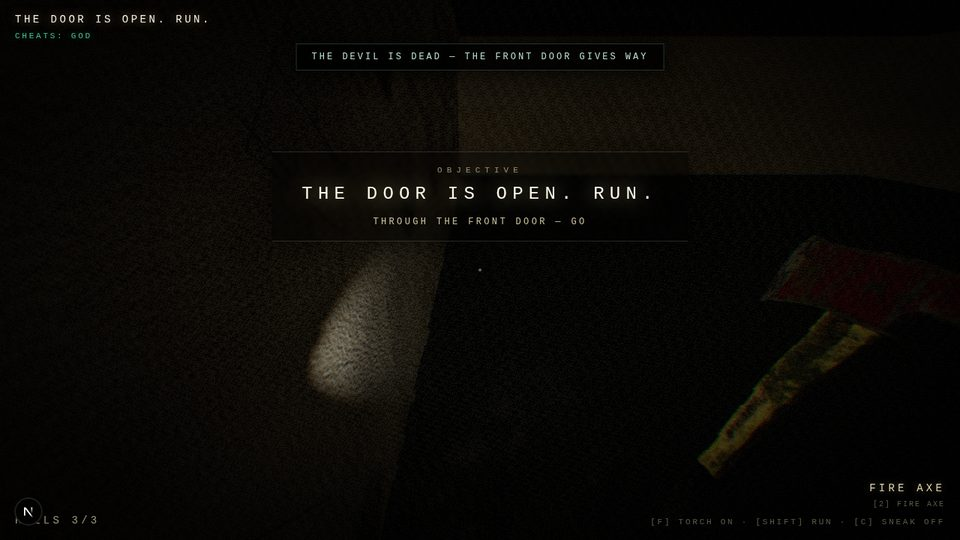 | 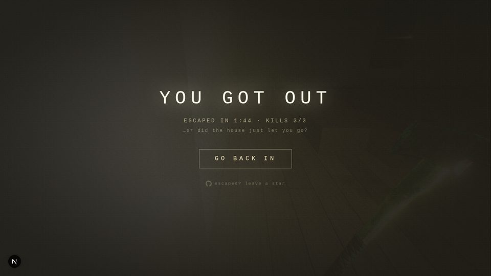 |

---

## How a run works

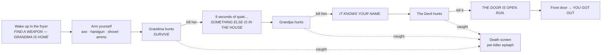
```mermaid
flowchart LR
    A["Wake up in the foyer<br/><i>FIND A WEAPON — GRANDMA IS HOME</i>"] --> B["Arm yourself<br/>axe · handgun · shovel · ammo"]
    B --> C["Grandma hunts<br/><i>SURVIVE</i>"]
    C -->|"kill her"| D["9 seconds of quiet…<br/><i>SOMETHING ELSE IS IN THE HOUSE</i>"]
    D --> E["Grandpa hunts"]
    E -->|"kill him"| F["<i>IT KNOWS YOUR NAME.</i>"]
    F --> G["The Devil hunts"]
    G -->|"kill it"| H["<i>THE DOOR IS OPEN. RUN.</i>"]
    H --> I["Front door → YOU GOT OUT"]
    C & E & G -. "caught" .-> X["Death screen<br/>per-killer epitaph"]
```

Every chase speed sits just *under* your sprint — beatable but scary:
stumbling on furniture or a closed door is what kills you.

---

## Controls

| Key | Action |
| --- | --- |
| `WASD` | Move |
| Mouse | Look |
| `LMB` | Attack (equipped weapon) |
| `E` | Interact — pickups / hiding spots / doors |
| `1 / 2 / 3` | Select weapon slot (handgun / axe / shovel) |
| `Shift` | Sprint (limited stamina, cancels sneak) |
| `C` | Toggle sneak — silent feet, slower, much harder to notice |
| `F` | Flashlight |
| `Esc` | Pause |

**On phones/tablets** the game switches to touch controls automatically:
left virtual stick to walk (push it all the way to run), drag the right
side of the screen to look, on-screen FIRE / WEAPON / TORCH / SNEAK /
interact buttons. Portrait orientation shows a "rotate your device"
screen — the house only exists in landscape.

---

## The hunters

One config table (`ENEMIES` in `app/game/engine/enemy.ts`) describes all
three tiers — same AI, different numbers, different monster:

| | Grandma | Grandpa | The Devil |
| --- | --- | --- | --- |
| HP | 100 | 150 | 250 |
| Chase speed | 4.32 m/s | 4.46 m/s | 4.60 m/s |
| Kill range | 1.3 m | 1.4 m | 1.7 m |
| Attack windup | 0.45 s | 0.50 s | 0.40 s |
| Handgun hits (40 dmg) | 3 | 4 | 7 |
| Axe hits (55 dmg) | 2 | 3 | 5 |
| Shovel hits (30 dmg) | 4 | 5 | 9 |

The AI behind all three — a roam / stalk / chase / search state machine
over grid A* pathfinding, with line-of-sight perception, noise hearing,
and a "horror director" that relocates the hunter near you when things
stay calm too long:

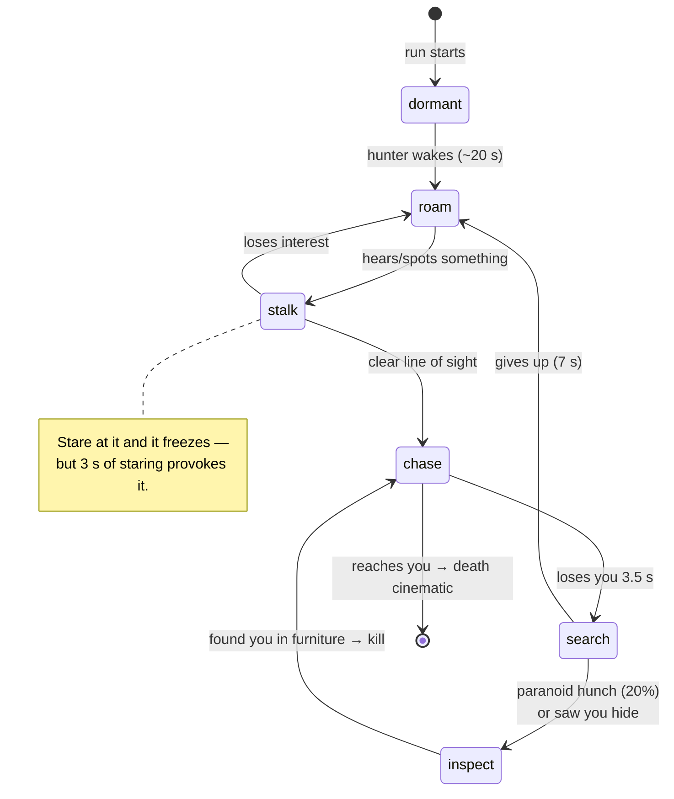
```mermaid
stateDiagram-v2
    [*] --> dormant: run starts
    dormant --> roam: hunter wakes (~20 s)
    roam --> stalk: hears/spots something
    stalk --> chase: clear line of sight
    chase --> search: loses you 3.5 s
    search --> roam: gives up (7 s)
    search --> inspect: paranoid hunch (20%)<br/>or saw you hide
    inspect --> chase: found you in furniture → kill
    stalk --> roam: loses interest
    chase --> [*]: reaches you → death cinematic
    note right of stalk
        Stare at it and it freezes —
        but 3 s of staring provokes it.
    end note
```

---

## Weapons & ammo

| Weapon | Type | Damage | Cooldown | Reach | Found in |
| --- | --- | --- | --- | --- | --- |
| Handgun | hitscan | 40 | 0.5 s | 40 m | study |
| Fire axe | melee | 55 | 1.0 s | 2.2 m | garage |
| Shovel | melee | 30 | 0.6 s | 2.0 m | storage |

Ammo is a single shared pool: **+6 rounds per crate**, 2–3 crates per run
(seeded placement). A full gun-only kill chain needs **14 hits** against
**12–18 rounds** in the house — the devil is deliberately ammo-hungry, so
misses hurt and melee finishers matter. Melee slightly outranges every
kill range: viable, but risky.

Gunfire is heard at 45 m. Swings at 12 m. The hunter *will* come.

---

## Hiding

Five wardrobes and three under-bed spots across the bedrooms and storage:

- **Unseen entry** → you are invisible and silent. Chase collapses into a
  search of your last known position. Hold still; listen to the footsteps.
- **Seen entry** (it had line of sight within the last ~1.5 s) → it walks
  over, bends down, looks inside… and drags you out. Granny-style.
- **Paranoia** → a searching hunter has a 20% chance (8 s cooldown) to
  check a hiding spot in the room where it lost you.

While hidden: movement locked, flashlight killed, weapons dead, view
narrowed to a door-crack slit. `E` or any movement key climbs back out
(0.5 s — no pop-out cheese).

---

## Balance (final numbers)

Player: walk **2.7 m/s** · sprint **4.7 m/s** (~7.7 s of sprint, ~7 s
refill, exhausted below 30%) · sneak **1.3 m/s**.

Grandma spawns **20 s** into the run; each kill buys **9 s** of calm
before the next tier. Hiding: seen-entering window **1.5 s**; search
paranoia **20%**, 8 s cooldown, 14 m radius. Attack windups give you a
fraction of a second to break line of sight before the blow lands.

---

## Tech stack

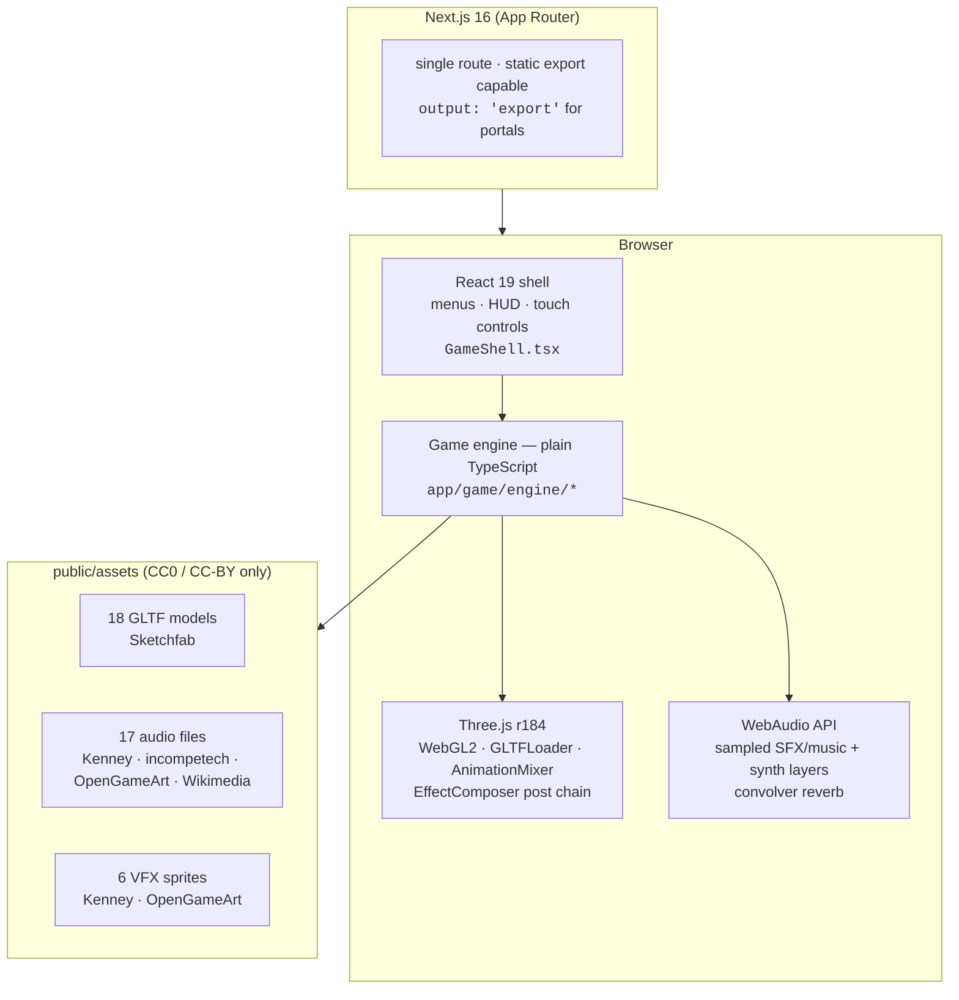
```mermaid
flowchart TB
    subgraph Browser
        UI["React 19 shell<br/>menus · HUD · touch controls<br/><code>GameShell.tsx</code>"]
        ENG["Game engine — plain TypeScript<br/><code>app/game/engine/*</code>"]
        GL["Three.js r184<br/>WebGL2 · GLTFLoader · AnimationMixer<br/>EffectComposer post chain"]
        WA["WebAudio API<br/>sampled SFX/music + synth layers<br/>convolver reverb"]
        UI --> ENG
        ENG --> GL
        ENG --> WA
    end
    subgraph App["Next.js 16 (App Router)"]
        R["single route · static export capable<br/><code>output: 'export'</code> for portals"]
    end
    subgraph Assets["public/assets (CC0 / CC-BY only)"]
        M["18 GLTF models<br/>Sketchfab"]
        S["17 audio files<br/>Kenney · incompetech · OpenGameArt · Wikimedia"]
        V["6 VFX sprites<br/>Kenney · OpenGameArt"]
    end
    App --> Browser
    ENG --> Assets
```

- **Next.js 16 + React 19** — app shell, routing, metadata, static export.
- **Three.js r184, raw** — no react-three-fiber, no game engine. A
  hand-rolled `Engine` class owns the renderer, the RAF loop and the post
  chain.
- **TypeScript** end-to-end; Tailwind CSS 4 for the HUD/menus.
- **WebAudio** — no audio engine; the whole mix is one hand-built graph.
- **No build-time art tools**: every wall/floor/ceiling texture is painted
  onto canvases at boot.

---

## Architecture

`app/game/engine/` — plain TypeScript, no framework in the hot loop:

- **`house.ts` / `level.ts`** — the house is a fixed, hand-designed
  single-floor plan (12 rooms: garage, kitchen, dining, study, 3 bedrooms,
  bathroom, storage, hallway, living room, foyer) declared as data in
  `house.ts` (rooms, doorways, furniture, item spawns, hiding spots,
  fixtures) and rasterized by `level.ts` onto a 1 m grid + wall-edge
  representation that drives collision, line-of-sight and A* for
  everything else.
- **`enemy.ts`** — the hunter. Grid A* pathfinding, roam/stalk/chase/
  search state machine, freeze-when-observed behavior, noise hearing,
  horror-director relocation, hiding-spot inspection (caught-entering +
  search paranoia). Skinned GLTF models with per-tier animation clips and
  pose-aware bounding-box normalization.
- **`weapons.ts`** — inventory, first-person viewmodels with procedural
  swing/recoil keyframes, hitscan for the gun, active-window cone check
  for melee, one shared ammo pool.
- **`hiding.ts`** — wardrobe / under-bed spots: climb-in/out lerp,
  occlusion, drag-out kills.
- **`items.ts`** — world pickups (weapons at fixed fiction spots, ammo
  seeded per run) and the exit door / beyond-light.
- **`vfx.ts`** — pooled world-space particles: muzzle flash, wall impacts,
  blood bursts + decals, death bursts, devil teleport smoke.
- **`audio.ts`** — sampled library (footsteps, gunshot, growls, creaks,
  stinger, heartbeat, dark-ambient music bed) with synthesized fallbacks
  and layers (fear drone, chase ducking, whispers, reverb).
- **`textures.ts`** — procedural PBR texture painting (wallpaper, wood
  floor, plaster, tile, concrete, doors) onto canvases at boot.
- **`fx.ts`** — post-processing: bloom, FXAA, and a custom fear shader
  (film grain, heartbeat vignette, chromatic aberration, VHS tearing).
- **`Engine.ts`** — game flow: kill-chain pacing, objective phases, HUD
  state, pointer-lock hardening, cheats, and the light orchestra (12
  pooled point lights assigned to the nearest fixtures each frame; the
  hunter suppresses lights around itself).

Two conventions keep the frame loop smooth:

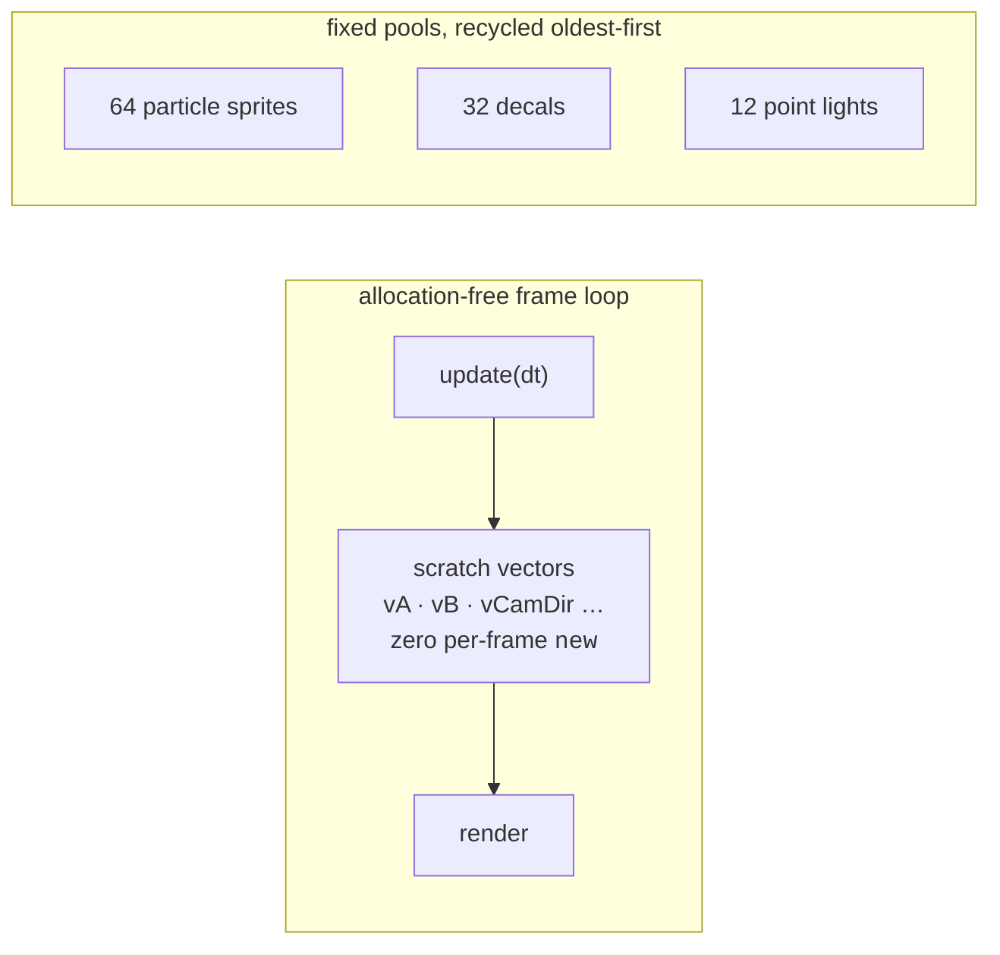
```mermaid
flowchart LR
    subgraph Loop["allocation-free frame loop"]
        U["update(dt)"] --> S["scratch vectors<br/>vA · vB · vCamDir …<br/>zero per-frame <code>new</code>"]
        S --> R["render"]
    end
    subgraph Pools["fixed pools, recycled oldest-first"]
        P1["64 particle sprites"]
        P2["32 decals"]
        P3["12 point lights"]
    end
```

No `new` in per-frame paths — GC pauses read as stutter.

`app/game/GameShell.tsx` — the React shell: VHS/CRT start menu, HUD,
objective banners, per-killer death screens, win screen, touch controls.

---

## Asset pipeline

Third-party assets live in `public/assets/` and are **CC0 / CC-BY only**
(no NC/ND/SA — portal monetization safety):

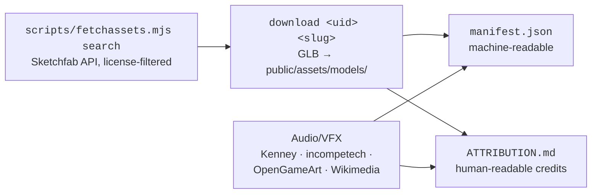
```mermaid
flowchart LR
    Q["<code>scripts/fetchassets.mjs search</code><br/>Sketchfab API, license-filtered"] --> D["<code>download &lt;uid&gt; &lt;slug&gt;</code><br/>GLB → public/assets/models/"]
    D --> MF["<code>manifest.json</code><br/>machine-readable"]
    D --> AT["<code>ATTRIBUTION.md</code><br/>human-readable credits"]
    AU["Audio/VFX<br/>Kenney · incompetech ·<br/>OpenGameArt · Wikimedia"] --> MF
    AU --> AT
```

- **18 models**: grandma, grandpa, devil, handgun, axe, shovel, ammo-box,
  wardrobe, bed, sofa, table, chair, bookshelf, fridge, kitchen-counter,
  lamp, door-interior, key (Sketchfab, CC-BY).
- **17 audio files**: Kenney packs (CC0), Kevin MacLeod / incompetech
  (CC-BY), TinyWorlds (CC0), Wikimedia Commons (public domain / CC-BY).
- **6 VFX sprites**: Kenney Particle Pack (CC0), OpenGameArt (CC0).

Full per-file credits: [`public/assets/ATTRIBUTION.md`](public/assets/ATTRIBUTION.md).
Everything else — textures, the house, the engine, post effects — is
generated by code.

---

## Development

```bash
pnpm install
pnpm dev        # http://localhost:3000
```

Requires Node.js 18+ and pnpm. (On machines where pnpm isn't on PATH,
`npx pnpm` works fine.)

Production build + lint:

```bash
pnpm build
pnpm lint
```

---

## Testing

Headless Chromium test/visual suite (Linux Playwright cache by default;
override with `BROWSER=/path/to/chrome`; dev server expected on `PORT`,
default 3001):

```bash
node scripts/smoke.mjs     # boot + walk + screenshots
node scripts/tour.mjs      # house tour screenshots + structural sanity
node scripts/flow.mjs      # FULL LOOP: weapon → kill chain → door → won (17 checks)
node scripts/inspect.mjs   # staged scenes: rooms, viewmodels, wardrobe, door
node scripts/p3.mjs        # enemy tiers / kill chain
node scripts/p4.mjs        # pickups, inventory, hit resolution, alerts (17 checks)
node scripts/p5.mjs        # hiding spots + AI perception (17 checks)
node scripts/p6.mjs        # world-space VFX (10 checks)
node scripts/p7.mjs        # sampled audio graph (16 checks)
node scripts/mobile.mjs    # emulated phone: rotate prompt + touch controls
node scripts/cheats.mjs    # redrum unlock + every cheat toggle
node scripts/diag.mjs      # bright-lit geometry/model diagnostics
```

Screenshots land in `scripts/shots/` (gitignored).

Asset/art utilities: `fetchassets.mjs` (Sketchfab acquisition),
`fixskin.mjs` / `fixspecgloss.mjs` (GLB repair tools), `genicon.mjs` /
`genog.mjs` / `gencover.mjs` (brand art generators — **still produce the
old backrooms branding**, regen pending new key art).

### Dev cheats

Type **`redrum`** at any point mid-run to unlock the cheat keys, then:

| Key | Cheat |
| --- | --- |
| `G` | God mode — it can't take you |
| `N` | Noclip — walk through walls, 2.4× speed |
| `B` | Fullbright — floodlight the whole level |
| `X` | Freeze / release the enemy |
| `K` | Deal 50 damage to the current enemy |
| `T` | Teleport to the exit door |

A toast confirms every toggle, and while any cheat is active a green
`CHEATS: …` line stays pinned under the objective.

---

## Portal build (CrazyGames etc.)

```bash
CG_EXPORT=1 pnpm build     # static export with relative asset paths → out/
node scripts/packcg.mjs    # CG_EXPORT build + URL rewrite + zip
node scripts/cgtest.mjs    # proves the bundle boots when served from a subfolder
```

`CG_EXPORT=1` switches the build to a fully static export
(`output: "export"`, `assetPrefix: "./"`) so the bundle runs from any CDN
subfolder; `packcg.mjs` additionally rewrites the remaining root-absolute
metadata URLs and zips `out/`. Current bundle size: ~114 MB (GLTF
compression is a planned optimization).

---

## Project structure

```
├── app/
│   ├── game/
│   │   ├── engine/          # the game engine (plain TS — see Architecture)
│   │   ├── GameShell.tsx    # React shell: menus, HUD, touch controls
│   │   └── GameCanvas.tsx   # client-only canvas mount
│   ├── layout.tsx           # metadata / JSON-LD
│   ├── manifest.ts          # PWA manifest
│   └── globals.css          # VHS/CRT menu effects, Tailwind
├── public/
│   └── assets/
│       ├── models/          # 18 GLTF models (CC0 / CC-BY)
│       ├── audio/           # 17 audio files
│       ├── vfx/             # 6 particle sprites
│       ├── manifest.json    # machine-readable asset index
│       └── ATTRIBUTION.md   # full per-file credits
├── scripts/                 # headless test suite + asset/art utilities
├── docs/images/             # README screenshots
└── AGENTS.md / CLAUDE.md    # contributor conventions (AI-agent oriented)
```

---

## Credits

**Game design, code, and direction by [Jennofrie](https://github.com/Jennofrie) — [Profexor](https://x.com/Profexor).**

- **Models, music, and sound effects** — CC0 / CC-BY artists, credited
  per-file in [`public/assets/ATTRIBUTION.md`](public/assets/ATTRIBUTION.md).
  Highlights: "Granny Remake" (UNKNOWN_PL), "Granny 3 — Grandpa" (wub),
  "Demon" (Steel Wasp / AC Game Assets), music "Darkest Child" by
  **Kevin MacLeod** (incompetech.com, CC-BY 4.0), sound packs by **Kenney**
  (CC0).
- **Font** — Special Elite (Apache 2.0), self-hosted.
- **Built with** — [Three.js](https://threejs.org),
  [Next.js](https://nextjs.org), [React](https://react.dev),
  [Tailwind CSS](https://tailwindcss.com).

---

## License

The **code** in this repository is licensed under the **MIT License** — see
[`LICENSE`](LICENSE).

The **assets** under `public/assets/` are **not** MIT-licensed; they are
licensed individually by their authors under CC0 / CC-BY / public-domain
terms — see [`public/assets/ATTRIBUTION.md`](public/assets/ATTRIBUTION.md).
CC-BY assets require credit to their original authors, which the game and
this repository provide.

---

<div align="center">
<i>Find a weapon. Kill what hunts you. Get out.</i><br/><br/>
<a href="https://github.com/Jennofrie/Horror-Granny">GitHub</a> ·
<a href="https://x.com/Profexor">@Profexor</a>
</div>
